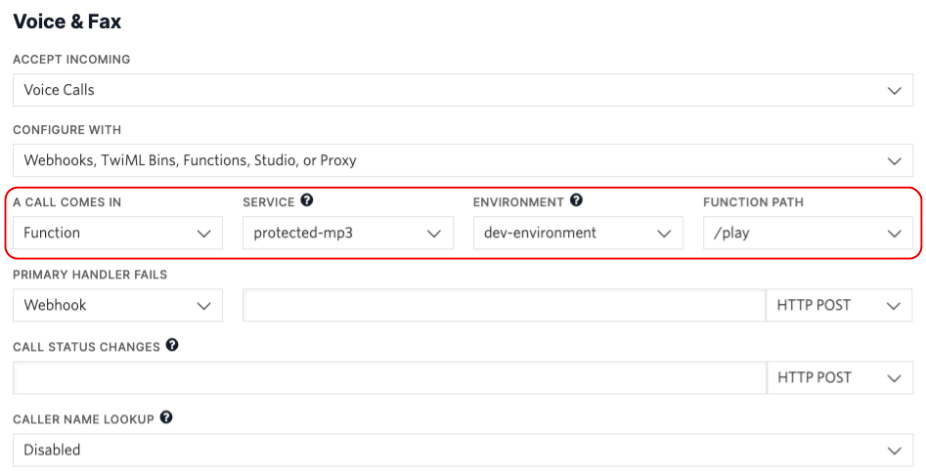

# Protected MP3

Twilio を使ってアクセス制限をかけた MP3 ファイルを再生します。  
従来の Twilio Assets の Private バージョンでは、最大10個までしかファイルが保存できないため、あまり実用的ではありませんでした。

[Twilio Assets上にPrivateで登録したmp3ファイルをFunctionsを使って再生する](https://qiita.com/mobilebiz/items/7958a0e2fa6c05c35eb9)

一方、[Runtime API](https://www.twilio.com/docs/runtime/functions-assets-api) を使った Assets では、Protected バージョンが利用でき、かつ最大1,000個までのファイルがアップロードできます。  
Protected バージョンで保存されたコンテンツは、アクセスする際に `X-Twilio-Signature` ヘッダが必要になります。

そこで今回は、この API バージョンを使って、アクセス制限がかかった MP3 ファイルを使ったサンプルプログラムをご紹介します。

## 準備

本記事を実施するにあたって、以下の環境が必要です。

- Twilio アカウント : [こちら](https://cloudapi.kddi-web.com/signup)から作成しましょう
- Twilio CLI のセットアップ : [こちらの記事](https://qiita.com/mobilebiz/items/456ce8b455f6aa84cc1e)を参考にしてください
- Twilio CLI Serverless plugins : [こちらの記事](https://qiita.com/mobilebiz/items/fb4439bf162098e345ae)を参考にしてください
- VSCodeなどのエディタ

## インストール

適当なディレクトリに移動します。

```sh
$ git clone https://github.com/mobilebiz/protected-mp3.git
$ cd protected-mp3
```

## 環境の設定

`.env.example` を `.env` にコピーして、API Key と API Secret を設定します。  
API Key については、[こちら](https://jp.twilio.com/console/project/api-keys)で作成することができます。

## 音源の準備

`assets` フォルダに、再生したい MP3 ファイルを入れます。  
このとき、ファイル名と拡張子（.mp3）の間に、`.protected` を入れてください。この設定により、MP3 ファイルが Protected バージョンとして保存されます。

## 再生用 TwiML の準備

今回はすでに、`functions` フォルダ内に `play.protected.js` を用意してあります。  
こちらを開いて、3行目にある MP3 ファイルの名前を、上で準備した MP3 ファイルに置き換えます。このとき、`.protected` の指定は**不要**ですので、気をつけてください。

## デプロイ

以下のコマンドを使って、Twilio 上にデプロイします。

```sh
$ twilio serverless:deploy --force
```

## 着信時の設定

ここまでの作業で、アクセス制限のかかった MP3 ファイルの生成準備が完了しました。  
Twilio 管理コンソールに[ログイン](https://jp.twilio.com/login/kddi-web)して、購入済み電話番号に先程デプロイした `play` Function を指定します。



## テスト

設定した電話番号に電話をして、MP3 ファイルが再生されることを確認します。  
また、MP3 ファイルや、再生用 Function をブラウザで直接開いても認証エラーになることを確認します。

`Unauthorized - you are not authenticated to perform this request`

## まとめ

今回のプログラムでのポイントは、MP3 ファイルや Functions を保存するときに、ファイル名に `.protected` を挟むことです。  
このようにすることで、Twilio 内部からの Webhook ではアクセスできますが、外部からのアクセスに対しては、 `X-Twilio-Signature` ヘッダが必要になります。  
もし、外部のプログラムから Protected なファイルにアクセスしたい場合は、以下のサイトを参考にしてください。  
[Twilio Functionsを外部からセキュアに呼び出す](https://qiita.com/mobilebiz/items/f8a8c795d5187e67166a)

## MP3の著作権について

本プログラムで使用している MP3 ファイルは、[MusMus](https://musmus.main.jp/)で公開されているものです。
利用規約については、[こちら](https://musmus.main.jp/info.html)をご覧ください。